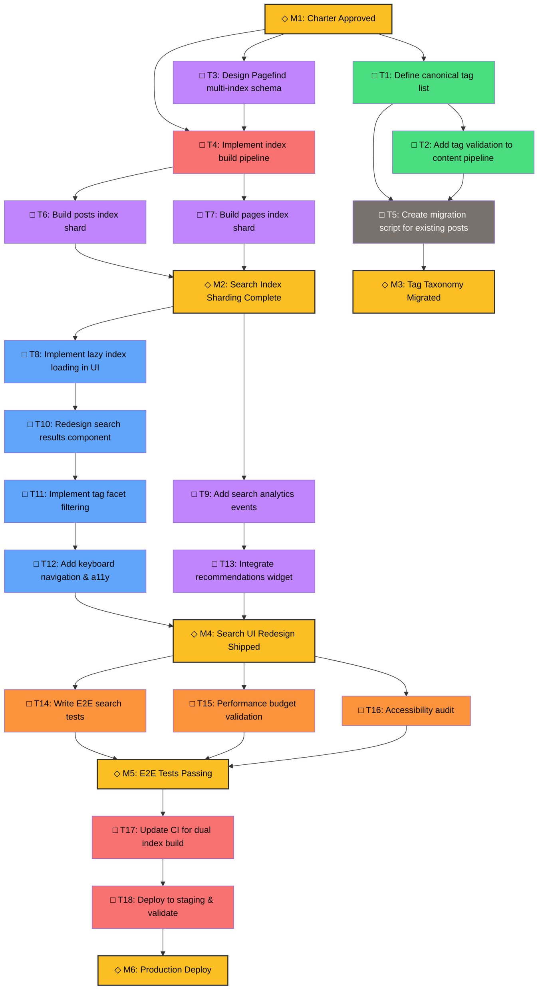

# Dependency Graph

> Visualizes task dependencies, ownership, and critical path. Update weekly during Active phase.

---

## Legend
- **Nodes**: Tasks/Deliverables
- **Edges**: Dependencies (→ means "blocks" or "must complete before")
- **Colors**: Role ownership (Content=🟢, Frontend=🔵, Search=🟣, Quality=🟠, Build=🔴, CLI=⚫, Lead=⚪)
- **Shapes**: □ Task, ◇ Milestone, ○ Decision

---

## Mermaid Diagram

---

## Task Table (Source of Truth)

| ID | Task | Owner Role | Status | Depends On | Blocks | Est. Days | Actual Days |
|----|------|------------|--------|------------|--------|-----------|-------------|
| T1 | Define canonical tag list | Content | [ ] | — | T2, T5 | 2 | |
| T2 | Add tag validation to pipeline | Content | [ ] | T1 | T5 | 1 | |
| T3 | Design multi-index schema | Search | [ ] | — | T4 | 2 | |
| T4 | Implement index build pipeline | Build | [ ] | T3 | T6, T7 | 3 | |
| T5 | Create migration script | CLI | [ ] | T1, T2 | M3 | 2 | |
| T6 | Build posts index shard | Search | [ ] | T4 | M2 | 1 | |
| T7 | Build pages index shard | Search | [ ] | T4 | M2 | 1 | |
| T8 | Lazy index loading UI | Frontend | [ ] | M2 | T10 | 2 | |
| T9 | Search analytics events | Search | [ ] | M2 | T13 | 1 | |
| T10 | Redesign search results | Frontend | [ ] | T8 | T11 | 3 | |
| T11 | Tag facet filtering | Frontend | [ ] | T10 | T12 | 2 | |
| T12 | Keyboard nav & a11y | Frontend | [ ] | T11 | M4 | 2 | |
| T13 | Recommendations widget | Search | [ ] | T9 | M4 | 2 | |
| T14 | E2E search tests | Quality | [ ] | M4 | M5 | 2 | |
| T15 | Performance budget | Quality | [ ] | M4 | M5 | 1 | |
| T16 | Accessibility audit | Quality | [ ] | M4 | M5 | 1 | |
| T17 | CI dual index build | Build | [ ] | M5 | T18 | 1 | |
| T18 | Staging deploy & validate | Build | [ ] | T17 | M6 | 1 | |

---

## Critical Path
`M1 → T3 → T4 → T6/T7 → M2 → T8 → T10 → T11 → T12 → M4 → T14/T15/T16 → M5 → T17 → T18 → M6`

**Estimated Duration**: ~22 working days (~4.5 weeks)

---

## Parallel Tracks
- **Track A (Content/Cli)**: T1 → T2 → T5 → M3 (independent, can run anytime after M1)
- **Track B (Search/Build)**: T3 → T4 → T6/T7 → M2 (critical path start)
- **Track C (Frontend)**: M2 → T8 → T10 → T11 → T12 → M4 (depends on M2)
- **Track D (Quality/Build)**: M4 → T14/T15/T16 → M5 → T17 → T18 → M6 (depends on M4)

---

## Risk Dependencies
| Risk | Affected Tasks | Mitigation |
|------|----------------|------------|
| Pagefind API changes | T3, T4, T6, T7 | Pin Pagefind version, test early |
| Migration script failures | T5, M3 | Dry-run on staging, backup frontmatter |
| a11y regression in redesign | T10, T11, T12 | Pair with Quality on T12, axe-core in CI |
| CI flakiness | T17 | Dedicated build agent, retry logic |

---

## Update Log
| Date | Updated By | Changes |
|------|------------|---------|
| YYYY-MM-DD | [Name] | Initial graph created |