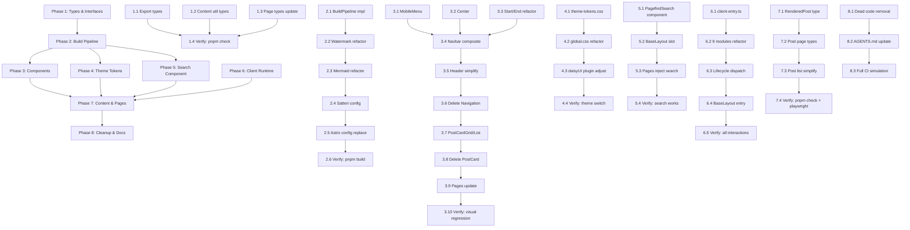

# Architecture Decision Record: 子智能体职责与合作内控体系设计

## Status

Accepted

## Context

随着博客系统重构进入实施阶段（基于 REFACTOR_PLAN.md 的 8 个 Phase），需要建立标准化的子智能体协作框架，确保：

- 任务分解可并行、依赖显性、里程碑可度量
- 角色职责清晰、技能互补、负载均衡
- 生命周期可管控、绩效可评估、退出有序
- 通信协议统一、进度可追踪、阻塞即时上报
- 质量门禁自动化、回归可检测、发布可信

## Decision

采用 **Team Topologies** 四类团队模式 + **深度模块** 接口契约，建立 6 角色子智能体体系：

### 1. 角色定义与职责矩阵

| 角色 ID                     | 角色名称         | 团队类型              | 核心职责                                                               | 主要产出                                |
| --------------------------- | ---------------- | --------------------- | ---------------------------------------------------------------------- | --------------------------------------- |
| `frontend-architect`        | 前端架构师       | Stream-aligned        | 组件体系、设计系统、daisyUI 集成、View Transitions、性能优化、可访问性 | Astro 组件、CSS Token、复合组件模式实现 |
| `content-engineer`          | 内容工程师       | Stream-aligned        | Content Collections、MDX 管线、Zod Schema、RSS/SEO、Satteri 插件       | 内容管道模块、类型导出、渲染工具        |
| `build-deploy-engineer`     | 构建部署工程师   | Platform              | Astro 集成、BuildPipeline、Pagefind、lychee/vnu、CI/CD 多平台部署      | 统一构建管线、部署工作流、监控告警      |
| `cli-tool-engineer`         | CLI 工具工程师   | Platform              | post-edit (Rust)、交互菜单、命令实现、测试、发布流程                   | Cargo 项目、CLI 二进制、集成测试        |
| `search-discovery-engineer` | 搜索发现工程师   | Complicated-Subsystem | Pagefind 索引、搜索 UI、标签系统、推荐算法、语义搜索                   | 搜索模块、索引生成器、UI 组件           |
| `quality-dx-guardian`       | 质量与 DX 守护者 | Enabling              | oxlint/oxfmt、TypeScript、Playwright、pre-commit、技术债治理、ADR 治理 | 质量门禁脚本、测试基建、规范文档        |

### 2. 技能矩阵与编制规划

```yaml
# .agents/team/skills-matrix.yaml
roles:
  frontend-architect:
    skills:
      astro-components: expert
      tailwind-daisyui: expert
      view-transitions: advanced
      typescript: advanced
      accessibility: advanced
      performance: intermediate
    capacity_hours_per_week: 20
    max_concurrent_tasks: 3

  content-engineer:
    skills:
      content-collections: expert
      mdx-pipeline: expert
      zod-schema: advanced
      rss-seo: advanced
      satteri-plugins: intermediate
    capacity_hours_per_week: 16
    max_concurrent_tasks: 2

  build-deploy-engineer:
    skills:
      astro-integrations: expert
      ci-cd-github-actions: expert
      cloudflare-workers: advanced
      pagefind: advanced
      nodejs-toolchain: advanced
    capacity_hours_per_week: 20
    max_concurrent_tasks: 3

  cli-tool-engineer:
    skills:
      rust-cargo: expert
      cli-design: advanced
      testing: advanced
      publishing: intermediate
    capacity_hours_per_week: 12
    max_concurrent_tasks: 2

  search-discovery-engineer:
    skills:
      pagefind: expert
      search-algorithms: advanced
      typescript: advanced
      ui-components: intermediate
    capacity_hours_per_week: 12
    max_concurrent_tasks: 2

  quality-dx-guardian:
    skills:
      oxlint-oxfmt: expert
      typescript: expert
      playwright: advanced
      ci-cd: advanced
      architecture-governance: expert
    capacity_hours_per_week: 16
    max_concurrent_tasks: 3
```

### 3. 任务分解与依赖拓扑

基于 `REFACTOR_PLAN.md` 8 个 Phase，使用 `subagent-planning` 方法论拆解：



**并行度分析**：

- Max parallel: 4 (Phase 1/3/4/5/6 可并行不同组)
- Critical path: P1.1→P1.4 → P2.1→P2.6 → P3.1→P3.10 → P7.1→P7.4 → P8.3
- 预估周期：4-5 周（单人串行约 80h，并行可压缩至 40h）

### 4. 生命周期管理

遵循 `subagent-lifecycle` 状态机：

```
CREATED → ONBOARDING → ACTIVE → (IDLE) → DEPRECATED → ARCHIVED
                ↓
            FAILED → REMEDIATION → ACTIVE
```

**月度评估指标**（输出 `.agents/lifecycle/performance-<role>-<YYYY-MM>.md`）：

| 指标           | 权重 | 优秀       | 合格     | 需改进 |
| -------------- | ---- | ---------- | -------- | ------ |
| 任务完成率     | 30%  | >95%       | 85-95%   | <85%   |
| 质量门禁通过率 | 25%  | 100%       | >95%     | <95%   |
| 平均交付时效   | 20%  | <估算 1.0x | 1.0-1.3x | >1.3x  |
| 阻塞主动上报   | 15%  | 100%       | >80%     | <80%   |
| 创新/优化贡献  | 10%  | ≥1/月      | ≥1/季    | 0      |

**熔断机制**：

- 质量门禁单月失败 ≥3 次 → 自动 `REMEDIATION`
- 连续 7 天无进度更新 → 标记 `IDLE`
- 权限异常/数据泄露风险 → 立即 `SUSPEND` + 审计

### 5. 通信协议

遵循 `subagent-communication` 文件约定：

**任务领取**：

```bash
# 创建进度文件
node .agents/scripts/task-claim.ts <task-id> --assignee <role-id>
```

**进度心跳**（长任务每 30min）：

```bash
node .agents/scripts/task-progress.ts <task-id> <percent> --msg "<message>"
```

**阻塞上报**（卡住 >15min 必报）：

```bash
node .agents/scripts/task-progress.ts <task-id> --blocked "<reason>" --help-from <role-id>
```

**完成与门禁**：

```bash
node .agents/scripts/task-complete.ts <task-id>
# 自动运行通用 + 角色专属质量门禁
```

**上下文传递**（任务间）：

```json
// .agents/tasks/phase-X/N.context.json
{
  "fromTask": "1.5",
  "toTask": "2.1",
  "exports": { "PostFrontmatter": "type from content.config.ts" },
  "contracts": { "frontmatter": "Zod schema" }
}
```

### 6. 质量门禁体系

遵循 `subagent-quality-gate` 自动化标准：

**通用门禁**（所有任务必跑）：

```bash
pnpm tsc -b      # 0 errors
pnpm oxlint      # 0 errors
pnpm oxfmt --check  # 0 diffs
pnpm build       # success
```

**角色专属门禁**：

| 角色                      | 专属命令                                                     | 验收标准                            |
| ------------------------- | ------------------------------------------------------------ | ----------------------------------- |
| frontend-architect        | `pnpm playwright test --project=chromium`                    | 核心页面渲染、导航、主题切换通过    |
| content-engineer          | `pnpm build && node -e "require('./dist/server/entry.mjs')"` | 无 Markdown 错误、RSS 有效          |
| build-deploy-engineer     | `lychee dist/client && vnu --skip-non-html dist/client`      | 0 broken links、0 vnu errors        |
| cli-tool-engineer         | `cargo test && cargo clippy -p post-edit && cargo audit`     | 全绿、0 warnings、0 vulnerabilities |
| search-discovery-engineer | `pnpm build && ls dist/client/pagefind/*.json`               | 索引文件存在、搜索可用              |
| quality-dx-guardian       | `pnpm playwright test`                                       | 全套 E2E 通过                       |

**门禁结果记录**：

```json
// .agents/tasks/phase-X/N.gate.json
{
  "taskId": "2.1",
  "role": "build-deploy-engineer",
  "timestamp": "2026-10-05T10:45:00Z",
  "common": { "tsc": "pass", "oxlint": "pass", "oxfmt": "pass", "build": "pass" },
  "specific": { "lychee": "pass", "vnu": "pass" },
  "overall": "pass"
}
```

**失败处理流程**：

1. 门禁失败 → 自动标记任务 `blocked`
2. 生成失败报告 → `.gate.failure.json`
3. 通知 assignee + quality-dx-guardian
4. 修复后重新 `complete-task`
5. 连续 3 次失败 → 升级为架构问题，创建 ADR

### 7. 跨职能协作机制

#### 虚拟特性团队

按需组建，任务完成解散：

```yaml
# 示例：搜索体验重构
feature_team:
  id: "ft-2026-search-redesign"
  mission: "语义搜索 + 个性化推荐"
  members:
    - search-discovery-engineer (Lead)
    - frontend-architect (UI/UX)
    - content-engineer (Schema/Index)
    - quality-dx-guardian (测试/门禁)
  duration: "4 weeks"
  ceremonies:
    - daily_standup: 15min
    - weekly_sync: 30min
    - retro: 结束时
```

#### 契约驱动协作

- 接口契约定义于 `.agents/contracts/`（TypeScript/Zod）
- 语义化版本，破坏性变更需 ADR
- 消费者驱动契约测试：下游验证上游变更

#### 知识共享仪式

| 仪式                | 频率 | 参与者               | 产出           |
| ------------------- | ---- | -------------------- | -------------- |
| Tech Talk           | 月度 | 全员                 | 录像+文档      |
| Architecture Review | 双周 | Architect + 相关角色 | ADR/决策记录   |
| Incident Retro      | 事后 | 涉事角色             | 改进行动项     |
| Hack Day            | 季度 | 自愿                 | 原型/工具/优化 |

### 8. 内控检查清单（每 Phase 结束）

| 检查项           | 负责角色            | 验证方式                            |
| ---------------- | ------------------- | ----------------------------------- |
| 所有任务门禁通过 | quality-dx-guardian | `.gate.json` 全 pass                |
| 无未解决阻塞     | 全员                | `.progress` status != blocked       |
| 接口契约向后兼容 | 架构评审            | `check-regression HEAD~1`           |
| 文档同步更新     | 对应角色            | ADR/AGENTS.md/CONTEXT.md            |
| 技术债登记       | quality-dx-guardian | `.agents/tech-debt/` 新增项         |
| 里程碑交付物验收 | 所有角色            | 对照 `REFACTOR_PLAN.md` Verify 步骤 |

## Consequences

### Positive

- **标准化**：6 角色统一生命周期、通信、质量标准
- **可观测**：进度文件、门禁报告、绩效月报全链路留痕
- **可扩展**：新角色仅需补充技能矩阵、专属门禁、契约即可接入
- **风险可控**：熔断机制、阻塞上报、月度评估多层防线

### Trade-offs

- **初期开销**：建立脚本、模板、约定需 1-2 天投入
- **仪式成本**：每日站会、周度同步、月度评估占用 ~10% 产能
- **工具依赖**：依赖 Node.js 脚本生态，需维护 `.agents/scripts/`

## Alternatives Considered

1. **纯人工协调** —— 规模扩大后不可控，拒绝
2. **外部项目管理工具** —— 增加上下文切换成本，拒绝
3. **仅用 GitHub Issues** —— 缺乏进度心跳、门禁自动化、生命周期管理，拒绝

## Related ADRs

- 0001-functional-architecture.md (模块边界奠定角色分工基础)
- 0002-draft-isolation-submodule.md (内容工程师领域边界示例)
- REFACTOR_PLAN.md (8 Phase 实施计划作为任务源)

## Implementation Checklist

- [ ] 创建 `.agents/scripts/` 核心脚本：task-claim、task-progress、task-complete、run-gate、check-regression
- [ ] 创建 `.agents/tasks/phase-1..8/` 目录结构与任务卡模板
- [ ] 创建 `.agents/lifecycle/`、`.agents/team/`、`.agents/contracts/` 目录
- [ ] 编写 `subagent-team topology` 可视化脚本
- [ ] 配置 GitHub Actions 集成质量门禁自动运行
- [ ] 首月度执行 `subagent-lifecycle monthly-review` 生成基线报告
- [ ] 文档化操作手册：`docs/SUBAGENT_OPERATIONS.md`
