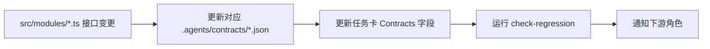

# Architecture Decision Record: AGENTS 知识更新流程设计

## Status
Accepted

## Context
知识库（AGENTS.md、CONTEXT.md、ADR、任务卡、模块接口等）需要随代码演进持续更新。缺乏标准化流程会导致：
- 文档与代码脱节
- 术语定义漂移
- 指针失效（文件移动/重命名后未更新引用）
- 子智能体加载过时上下文

需要一套 **最小化、自动化、可追溯** 的更新流程。

## Decision
建立 **四层触发机制** + **三类更新操作** + **自动化守护** 的更新流程。

---

### 1. 四层触发机制

| 层级 | 触发条件 | 处理时限 | 责任角色 | 示例 |
|------|----------|----------|----------|------|
| **L0: 代码即文档** | 代码变更自动反映 | 即时 | — | `package.json` scripts、接口导出、类型定义 |
| **L1: Phase 级同步** | Phase 完成 / 里程碑 | Phase 结束前 | 对应角色 + quality-dx-guardian | 任务卡归档、REFACTOR_PLAN 勾选、CONTEXT.md 术语同步 |
| **L2: 变更级同步** | 破坏性变更 / 新增概念 | PR 合并前 | 变更发起者 | 新增术语、接口签名变更、架构决策 |
| **L3: 定期巡检** | 月度/季度 | 固定周期 | quality-dx-guardian | 指针失效扫描、ADR 过期审查、健康度报告 |

---

### 2. 三类更新操作

#### A. 术语更新


**规则**：
- 新术语 → 先入 CONTEXT.md → 再在别处使用
- 禁止在 ADR/任务卡/白皮书中重复定义术语
- 术语重命名 → CONTEXT.md 改名 + 全库搜索替换 + ADR 记录重命名原因

#### B. 接口/契约更新


**规则**：
- 接口签名变更 → 必须同步更新契约文件 + 任务卡
- 破坏性变更 → 需 ADR (0005+)
- 版本号：契约文件内 `version` 字段语义化递增

#### C. 指针/引用更新


**规则**：
- 任何重构移动文件 → 必须运行 `pnpm exec tsx .agents/scripts/scan-pointers.ts`
- AGENTS.md 指针表、任务卡 `Specs/Contracts` 字段、ADR 相对路径全覆盖

---

### 3. 自动化守护脚本

#### 3.1 指针扫描器
```bash
# .agents/scripts/scan-pointers.ts
# 用法: pnpm exec tsx .agents/scripts/scan-pointers.ts [--fix]
# 功能:
#   1. 解析 AGENTS.md、所有任务卡、所有 ADR 中的相对路径引用
#   2. 验证目标文件存在
#   3. --fix: 自动修复已知模式的路径变更（基于 git log --follow）
#   4. 输出报告: .agents/reports/pointer-scan-<timestamp>.json
```

#### 3.2 术语一致性检查
```bash
# .agents/scripts/check-terms.ts
# 用法: pnpm exec tsx .agents/scripts/check-terms.ts
# 功能:
#   1. 读取 CONTEXT.md 术语表
#   2. 扫描所有 .md/.ts 文件中的术语使用
#   3. 报告：未定义术语、定义冲突、疑似重复定义
#   4. 输出: .agents/reports/term-check-<timestamp>.json
```

#### 3.3 契约同步检查
```bash
# .agents/scripts/sync-contracts.ts
# 用法: pnpm exec tsx .agents/scripts/sync-contracts.ts
# 功能:
#   1. 对比 src/modules/*.ts 导出接口与 .agents/contracts/*.json
#   2. 对比任务卡 Contracts 字段与实际契约文件
#   3. 报告不一致
```

#### 3.4 回归检查增强
```bash
# 现有 check-regression.ts 扩展
# 新增: 对比基准 commit 的指针有效性、术语完整性
```

---

### 4. CI 集成

```yaml
# .github/workflows/knowledge-guard.yml
name: Knowledge Base Guard
on:
  pull_request:
    types: [opened, synchronize, reopened]
  schedule:
    - cron: '0 2 1 * *'  # 月度巡检
  workflow_dispatch:

jobs:
  pointer-scan:
    runs-on: ubuntu-latest
    steps:
      - uses: actions/checkout@v4
      - run: pnpm install --frozen-lockfile
      - run: pnpm exec tsx .agents/scripts/scan-pointers.ts
        continue-on-error: true

  term-check:
    runs-on: ubuntu-latest
    steps:
      - uses: actions/checkout@v4
      - run: pnpm install --frozen-lockfile
      - run: pnpm exec tsx .agents/scripts/check-terms.ts
        continue-on-error: true

  contract-sync:
    runs-on: ubuntu-latest
    steps:
      - uses: actions/checkout@v4
      - run: pnpm install --frozen-lockfile
      - run: pnpm exec tsx .agents/scripts/sync-contracts.ts
        continue-on-error: true

  regression:
    runs-on: ubuntu-latest
    steps:
      - uses: actions/checkout@v4
      - run: pnpm install --frozen-lockfile
      - run: pnpm exec tsx .agents/scripts/check-regression.ts HEAD~1
        continue-on-error: true
```

**失败策略**：
- PR 阶段：警告不阻断，但 quality-dx-guardian 必须审查
- 月度巡检：失败创建 Issue 分配给 quality-dx-guardian

---

### 5. 更新流程标准化

#### 5.1 Phase 结束清单
```markdown
# Phase N 完成清单
- [ ] 所有任务卡 status=done、Outputs 填写完整
- [ ] 任务卡归档至 .agents/tasks/archive/phase-N/
- [ ] REFACTOR_PLAN.md 对应阶段勾选完成
- [ ] CONTEXT.md 新增/变更术语同步
- [ ] 相关 ADR 状态更新（Proposed→Accepted/Deprecated）
- [ ] 指针扫描通过
- [ ] 契约同步检查通过
- [ ] 生成里程碑报告: .agents/milestones/phase-N.md
```

#### 5.2 PR 模板强制字段
```markdown
## 知识库影响
- [ ] 无影响
- [ ] 新增术语 → 已更新 CONTEXT.md
- [ ] 接口变更 → 已同步契约文件 + 任务卡
- [ ] 文件移动 → 已运行指针扫描并修复
- [ ] 架构决策 → 已创建/更新 ADR (编号: 000X)

## 验证
- [ ] pnpm check && pnpm build 通过
- [ ] pnpm exec tsx .agents/scripts/scan-pointers.ts 通过
- [ ] pnpm exec tsx .agents/scripts/check-terms.ts 通过
- [ ] 角色专属质量门禁通过
```

#### 5.3 月度巡检清单
```markdown
# 月度知识库巡检 <YYYY-MM>
## 指针健康度
- 总指针数: X
- 失效指针: Y (已修复/待修复)
- 孤立文档: Z

## 术语健康度
- 术语总数: X
- 未定义使用: Y
- 重复定义: Z
- 过期术语: W

## 契约健康度
- 模块接口数: X
- 契约文件同步率: Y%
- 任务卡引用同步率: Z%

## ADR 状态
- Accepted: X
- Proposed: Y
- Deprecated: Z (需清理)
- Superseded: W

## 行动项
- [ ] 修复失效指针
- [ ] 补充未定义术语
- [ ] 归档过期 ADR
- [ ] 生成健康度报告: docs/KNOWLEDGE_HEALTH_<YYYY-MM>.md
```

---

### 6. 角色职责矩阵

| 操作 | 发起者 | 执行者 | 审批者 | 自动化 |
|------|--------|--------|--------|--------|
| 新增术语 | 任意角色 | 发起者 | quality-dx-guardian | check-terms CI |
| 接口变更 | 对应角色 | 发起者 | 下游角色 + quality-dx-guardian | contract-sync CI |
| 文件移动 | 重构发起者 | 发起者 | quality-dx-guardian | scan-pointers CI |
| 创建 ADR | 变更发起者 | 发起者 | 全员评审 | — |
| Phase 归档 | 对应角色 | 对应角色 | quality-dx-guardian | — |
| 月度巡检 | — | quality-dx-guardian | — | 定时 CI |
| 季度健康度报告 | quality-dx-guardian | quality-dx-guardian | 全员确认 | — |

---

### 7. 版本与归档策略

| 制品 | 版本策略 | 保留期限 | 存储位置 |
|------|----------|----------|----------|
| CONTEXT.md | 随代码版本 | 永久 | 仓库根目录 |
| ADR | 不变更历史，新增 Superseded | 永久 | docs/adr/ |
| 任务卡 | Phase 归档 | 2 年 | .agents/tasks/archive/ |
| 契约文件 | 语义化版本 (v1.2.3) | 永久 | .agents/contracts/ |
| 健康度报告 | YYYY-MM | 2 年 | docs/KNOWLEDGE_HEALTH_<YYYY-MM>.md |
| 指针扫描报告 | 时间戳 | 30 天 | .agents/reports/ |

---

### 8. 例外与熔断

| 场景 | 处理 |
|------|------|
| 紧急热修复无法完成文档同步 | PR 合并后 24h 内补齐，创建技术债卡片 |
| 批量重构导致指针大量失效 | 分批提交，每批运行 scan-pointers --fix |
| 术语冲突无法快速解决 | 暂时保留双定义，ADR 记录冲突，下个 Phase 解决 |
| 契约破坏性变更无下游配合 | 发布 vNext 版本，旧版标记 deprecated，给 1 个 Phase 迁移期 |

---

## Consequences

### Positive
- **零手工巡检**：核心检查全自动化入 CI
- **可追溯**：每次变更有 PR、Issue、ADR 链路
- **分层负担**：日常靠 L0/L1，重构靠 L2，长期靠 L3
- **角色清晰**：quality-dx-guardian 兜底，业务角色各司其职

### Trade-offs
- **初期脚本开发成本**：~2 天投入
- **CI 时间增加**：~2 分钟/次（并行可接受）
- **强制字段增加 PR 模板长度**：需团队适应

## Alternatives Considered
1. **纯人工 Wiki 维护** —— 历史证明不可持续，拒绝
2. **外部知识库** —— 增加同步延迟、认知切换，拒绝
3. **只靠 Code Review** —— 易漏指针/术语，拒绝

## Related Documents
- docs/adr/0004-agents-knowledge-base-architecture.md (架构基础)
- docs/KNOWLEDGE_BASE_QUICKREF.md (快速导航)
- .agents/scripts/scan-pointers.ts (待实现)
- .agents/scripts/check-terms.ts (待实现)
- .agents/scripts/sync-contracts.ts (待实现)

## Implementation Checklist
- [ ] 实现 scan-pointers.ts
- [ ] 实现 check-terms.ts
- [ ] 实现 sync-contracts.ts
- [ ] 增强 check-regression.ts
- [ ] 创建 .github/workflows/knowledge-guard.yml
- [ ] 更新 PR 模板强制知识库影响字段
- [ ] 创建 Phase 结束清单模板
- [ ] 创建月度巡检清单模板
- [ ] 编写操作手册: docs/KNOWLEDGE_UPDATE_PROCESS.md