# 架构图谱

## 模块依赖图 (Module Dependency Graph)

```mermaid
graph TD
    %% 核心模块层
    CP[ContentPipeline] --> Types[types.ts]
    BP[BuildPipeline] --> Types
    TS[ThemeSystem] --> Types
    SM[SearchModule] --> Types
    CR[ClientRuntime] --> Types
    TA[TelegramAuthModule] --> Types
    UI[UIComponents] --> Types

    %% 构建管线内部阶段
    BP --> PF[PagefindIndexer]
    BP --> LC[LinkChecker]
    BP --> HV[HtmlValidator]
    BP --> MR[MermaidRenderer]
    BP --> WI[WatermarkInjector]
    PF -.-> FW[FileWalker]
    MR -.-> FW
    WI -.-> FW

    %% 客户端运行时模块
    CR --> MT[ThemeToggle]
    CR --> TC[TOC]
    CR --> RP[ReadingProgress]
    CR --> SR[ScrollReveal]
    CR --> TD[TiltCard]
    CR --> CC[CodeCopy]
    CR --> TA2[TelegramAuth Client]
    CR --> GF[GravatarFallback]

    %% UI 组件依赖
    UI --> Navbar
    UI --> PostCardGrid
    UI --> PostCardList
    UI --> Tag
    UI --> PagefindSearch
    UI --> BaseLayout

    %% 页面级组合
    Pages[Pages/Layouts] --> CP
    Pages --> UI
    Pages --> CR
    Pages --> SM
    Pages --> TA

    %% 外部系统
    CP -.-> AstroContent[Astro Content Collections]
    BP -.-> AstroHooks[astro:build:done]
    SM -.-> PagefindCLI[Pagefind CLI]
    TA -.-> TelegramBot[Grammy Bot]
    CR -.-> ViewTransitions[astro:transitions]
```



## 接口契约矩阵 (Interface Contract Matrix)

| Module | Exported Interface | Key Methods | Consumers |
|--------|-------------------|-------------|-----------|
| **ContentPipeline** | `ContentPipeline` | `getPublishedPosts()`, `renderPost(id)` | Pages, RSS, Sitemap, Search Index |
| **BuildPipeline** | `BuildPipeline` | `execute(distDir)`, `registerStage()` | `astro.config.ts` (integration) |
| **ThemeSystem** | `ThemeSystem` | `init()`, `toggleTheme()`, `onThemeChange()` | `BaseLayout`, `Navbar`, `PagefindSearch` |
| **SearchModule** | `SearchModule` | `generateIndex()`, `<PagefindSearch />` | `buildPipeline`, `Posts pages` |
| **ClientRuntime** | `ClientRuntime` | `registerModule()`, `start()` | `BaseLayout` (single entry) |
| **TelegramAuthModule** | `TelegramAuthModule` | `initClient()`, `AuthWallProps`, `pollAuthStatus()` | `PostPage`, `ClientRuntime` |
| **UIComponents** | Component Factories | `Navbar`, `PostCardGrid/List`, `Tag`, `PagefindSearch`, `BaseLayout` | All Pages |

## 数据流向 (Data Flow)

### 构建时
```
src/posts/*.md
    │
    ▼
[Content Collections: glob loader]
    │
    ├──▶ Zod Schema 验证 ──▶ PostFrontmatter (类型安全)
    │
    ├──▶ satteri Markdown 处理器
    │       ├──▶ heading IDs
    │       ├──▶ 外链标记
    │       ├──▶ 日期自动填充 (git log)
    │       └──▶ Mermaid 代码块标记
    │
    ├──▶ MDX 渲染 (@astrojs/mdx)
    │
    ├──▶ getStaticPaths() ──▶ 生成路由
    │
    ├──▶ RSS 生成 (@astrojs/rss)
    │
    ├──▶ Sitemap 生成 (@astrojs/sitemap)
    │
    └──▶ astro:build:done
            │
            ▼
    [BuildPipeline.execute()]
            │
            ├──▶ PagefindIndexer ──▶ dist/client/pagefind/
            ├──▶ LinkChecker (lychee)
            ├──▶ HtmlValidator (vnu-jar)
            ├──▶ MermaidRenderer ──▶ 内联 SVG
            └──▶ WatermarkInjector ──▶ 零宽水印
```

### 运行时 (客户端)
```
用户访问页面
    │
    ▼
[BaseLayout] ──▶ <ClientRouter /> (SPA 模式)
    │
    ├──▶ <script> client-entry.ts (单一入口)
    │       │
    │       ├──▶ clientRuntime.start()
    │       │       │
    │       │       ├──▶ registerModule(ThemeToggle) ──▶ 初始化主题
    │       │       ├──▶ registerModule(TOC) ──▶ 生成目录
    │       │       ├──▶ registerModule(ReadingProgress)
    │       │       ├──▶ registerModule(ScrollReveal)
    │       │       ├──▶ registerModule(TiltCard)
    │       │       ├──▶ registerModule(CodeCopy)
    │       │       ├──▶ registerModule(TelegramAuth) ──▶ 认证墙轮询
    │       │       └──▶ registerModule(GravatarFallback)
    │       │
    │       └──▶ routerEvents 分发
    │               ├──▶ astro:page-load ──▶ 所有模块 onPageLoad
    │               ├──▶ astro:after-swap ──▶ 需要 DOM 重新绑定的模块
    │               └──▶ astro:before-preparation ──▶ 可选
    │
    ├──▶ <Navbar /> (复合组件)
    │       ├──▶ <Navbar.Start />
    │       ├──▶ <Navbar.Center links={[]} />
    │       ├──▶ <Navbar.End /> (含 ThemeToggle 按钮)
    │       └──▶ <Navbar.MobileMenu />
    │
    ├──▶ <PagefindSearch slot="search" /> (搜索槽位)
    │
    └──▶ <main><slot /></main> (页面内容)
            │
            ├──▶ PostPage: <TelegramAuthWall /> 或 <Content />
            │       └──▶ TOC 侧边栏 / 移动端面板
            │
            └──▶ PostList: <PostCardGrid posts={[]} />
```

## 模块边界决策记录 (Seam Decisions)

| Seam | Location | Why Here | Adapters |
|------|----------|----------|----------|
| **ContentPipeline** | `src/modules/content-pipeline.ts` | 隔离 Astro Content Collections API 变更 | 单一实现 (生产), 内存实现 (测试) |
| **BuildPipeline** | `src/modules/build-pipeline.ts` | 统一 5 个构建阶段，复用文件遍历 | 真实 FS (生产), MemFS (测试) |
| **ThemeSystem** | `src/modules/theme-system.ts` + `theme-tokens.css` | CSS 变量单一源，daisyUI/Tailwind 解耦 | 无 (纯 CSS + 极简 TS) |
| **SearchModule** | `src/modules/search.ts` | Pagefind CLI/UI 变更不波及页面 | 声明式 UI (生产), 模块化 UI (备选) |
| **ClientRuntime** | `src/modules/client-runtime.ts` | 9 个脚本统一生命周期，便于测试/禁用 | 真实 DOM (生产), JSDOM (测试) |
| **TelegramAuthModule** | `src/modules/telegram-auth.ts` | 前后端契约分离，Bot 可独立演进 | Grammy Bot (生产), Mock Bot (测试) |
| **UIComponents** | `src/modules/ui-components.ts` | 复合组件模式，Props 类型安全 | 无 (Astro 组件即实现) |

## 深度模块评分 (Depth Assessment)

| Module | Interface Size | Implementation Complexity | Depth Score | Notes |
|--------|---------------|---------------------------|-------------|-------|
| ContentPipeline | 5 methods | High (loader, schema, render, RSS, sitemap) | ⭐⭐⭐⭐⭐ | 核心杠杆点 |
| BuildPipeline | 2 methods | High (5 stages, file walker, error aggregation) | ⭐⭐⭐⭐⭐ | 消除重复遍历 |
| ThemeSystem | 4 methods + CSS vars | Medium (CSS tokens, daisyUI integration) | ⭐⭐⭐⭐ | 一处改变全局生效 |
| SearchModule | 3 methods + Component | Medium (Pagefind CLI + UI variants) | ⭐⭐⭐⭐ | 组件化隔离 |
| ClientRuntime | 3 methods | Medium (registry, lifecycle, deps) | ⭐⭐⭐⭐ | 统一入口消除碎片 |
| TelegramAuthModule | 6 methods | High (wall, polling, JWT, Bot API) | ⭐⭐⭐⭐ | 前后端契约明确 |
| UIComponents | 6 component factories | Medium (daisyUI + composite pattern) | ⭐⭐⭐ | 复合组件减少 Props 爆炸 |

## 迁移路径 (Migration Path)

```
Phase 1: Types      → src/modules/types.ts (完成)
Phase 2: Pipeline   → build-pipeline.ts 替换 4 旧集成
Phase 3: Components → Navbar 复合 + PostCard 变体分离
Phase 4: Theme      → theme-tokens.css + theme-system.ts
Phase 5: Search     → PagefindSearch 组件化
Phase 6: Client     → client-runtime.ts + 9 模块重构
Phase 7: Content    → content-pipeline.ts 类型安全
Phase 8: Cleanup    → 删除旧文件、更新文档、CI 验证
```

每阶段独立可回滚，`git tag phase-{1..8}-done` 标记。